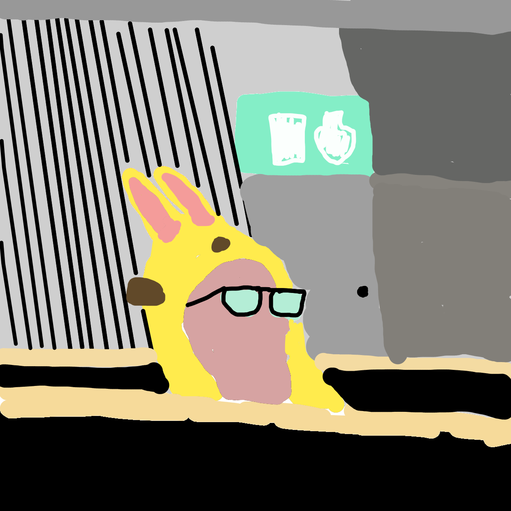

# Edgar Torture Machine
**Edgar Torture Machine** is about our favorite* teachers' assistant Edgar who failed to many courses in University. CSN demanded all their money back, but Edgar had already spent it on äppel juice. Then Kronofogden attacked, they took everything and Freddan, when he was needed most, dissappeared. Edgar is now in prison with little hope to ever return. We met our protagonist in a nightmare, Fem Nätter Hos Freddan. Will he come back alive? (Find out on Roblox, add Coolajonas06)

Welcome to our projInda project, Edgar Torture Machine™. ProjInda, DD1349, is the finishing course in the introductory programming courses of KTH civilengineeringprogram computer enginering. Our main goal was to create a VERY great experience for our teacher's assistant, Edgar. Hello Edgar, hope you liked it as much as we did! The project was originally going to be written and created in Roblox Studios and its main language luau, a modified version of lua made specifically for roblox. Due to unforseen circumstances of roblox not allowing our audio and images, we also created a version made with Java, JNI (Java Native Interface), C++, that followed our vision of the gambling machine more closely. To learn these languages we used Roblox Studio Docs, tutorials on youtube, ChatGPT and Gemini, which were also used for troubelshooting. Roblox studio plugins, Redupe, build tools f3x, archimedes, Rojo. VS code plugins, Rojo. The game should hopefully be a slot machine with pictures of Edgar as the symbols, a spin button, bonus spins and a balance and bet system. As it was made in roblox there will also be the story leading to the slot machine.

## Demo Video
[demo video](https://www.youtube.com/watch?v=K810rDBlO4Y)

## Run games
Roblox version can be played by adding Coolajonas06/VadHander on roblox

To run java version cd into prototype/src and run java window

## Installation
### Use Git with Roblox studio

Install VS Code

Install Rojo Plugin in VS Code
1. Find it in plugin store
2. pull git repo
3. use command palette to install Rojo into the repo
4. Edit default.project.json to include all folders you want to use in VS code
5. Add "ignoreUnkownInstances": true so Rojo doesn't delete stuff in Roblox Studio
6. Launch Rojo Local server through command palette

Install Rojo plugin in Roblox Studio
1. Find it under plugins in asset store
2. Click to launch after install
3. The plugin will ask to connect
4. Accept and review changes it wants
5. Rojo will now update Studios when coding in VS code

Use git in VS code to upload changes.

## Thoughts
Rojo was har to work with. It deleted our stuff, added back things we had deleted, the editor in Roblox studio was much better as it can find objects in the world, It created it's own folders instead of using the existing ones so we had to manually move scripts to their correct locations.

We hate roblox. They hate fun. We were unable to upload audio, images, ANYTHING fun. Therefore we do not recommend creating your own roblox experience unless it is strictly made with roblox assets, blender models and your own non copyright music. Instead look into godot, as we should have done too.

Our favorite images out of this project

